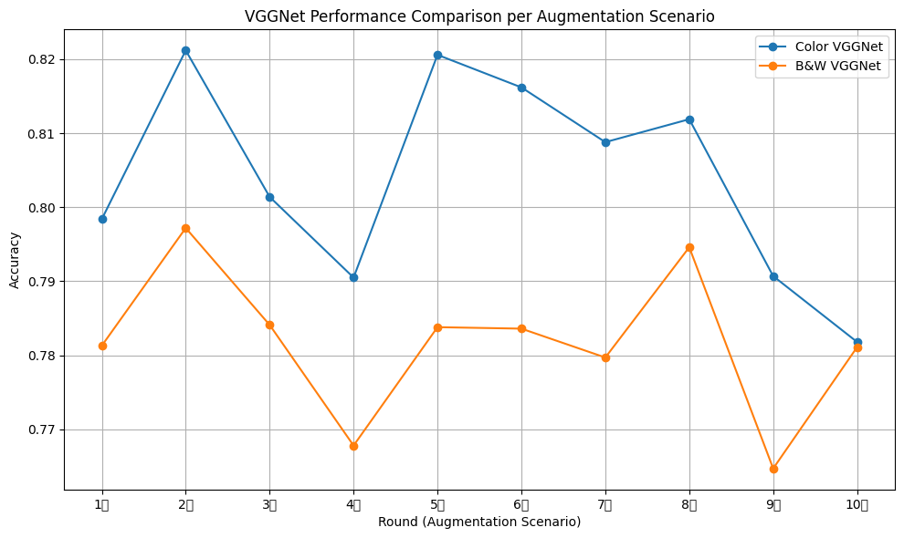

# Week 4  

Understanding deep learning augmentation using various geometric(flip, translation, rotation, scale, and shrink).  

1. Research on the model with the highest accuracy by finding the appropriate augmentation for the training data - Augmenting the image using Keras' ImageDataGenerator - Evaluating the model accuracy using the model.evaluate function.  

2. Converting training data to black and white to study the model with the highest accuracy in black and white - Augmenting images using Keras' ImageDataGenerator - Evaluating model accuracy using the model.evaluate function

3. Saving and loading the trained model - Evaluating model accuracy using the model.evaluate function is done by saving the trained model and then loading the model to evaluate its performance.  

# Results

# VGGNet Summary Table

| Round | Rotation | Flip | Movement | Zoom | Color_Acc | B&W_Acc | Best_Model |
|-------|----------|------|---------|------|-----------|---------|------------|
| 1차   | 0        | ❌    | 0.0     | 0.0  | 0.7984    | 0.7813  | Color      |
| 2차   | 0        | ✅    | 0.0     | 0.0  | **0.8212** | 0.7972  | Color ✅   |
| 3차   | 0        | ❌    | 0.1     | 0.0  | 0.8014    | 0.7841  | Color      |
| 4차   | 0        | ❌    | 0.0     | 0.1  | 0.7905    | 0.7678  | Color      |
| 5차   | 0        | ✅    | 0.1     | 0.0  | 0.8206    | 0.7838  | Color      |
| 6차   | 0        | ✅    | 0.0     | 0.1  | 0.8162    | 0.7836  | Color      |
| 7차   | 0        | ❌    | 0.1     | 0.1  | 0.8088    | 0.7797  | Color      |
| 8차   | 0        | ✅    | 0.1     | 0.1  | 0.8119    | 0.7946  | Color      |
| 9차   | 15       | ✅    | 0.1     | 0.1  | 0.7907    | 0.7647  | Color      |
| 10차  | 15       | ✅    | 0.1     | 0.1  | 0.7818    | 0.7811  | Color      |

# Performance comparison chart  

